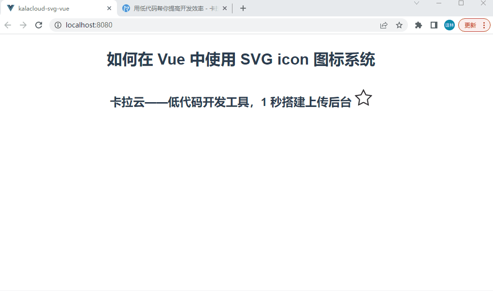

# SVG 使用教程：如何在 Vue 中使用 SVG icon 图标系统

本教程配套文章请访问卡拉云技术博客：《[SVG 使用教程：如何在 Vue 中使用 SVG icon 图标系统](https://kalacloud.com/blog/using-svg-and-vue-complete-guide/)》

本教程教大家如何在 Vue 中引入 SVG icon 图标系统，然后教大家如何一步步搭建一套 SVG 图标系统，下图为跟随本教程最终的搭建效果。




# kalacloud-svg-vue

## Project setup
```
npm install
```

### Compiles and hot-reloads for development
```
npm run serve
```

### Compiles and minifies for production
```
npm run build
```

### Lints and fixes files
```
npm run lint
```

### Customize configuration
See [Configuration Reference](https://cli.vuejs.org/config/).
